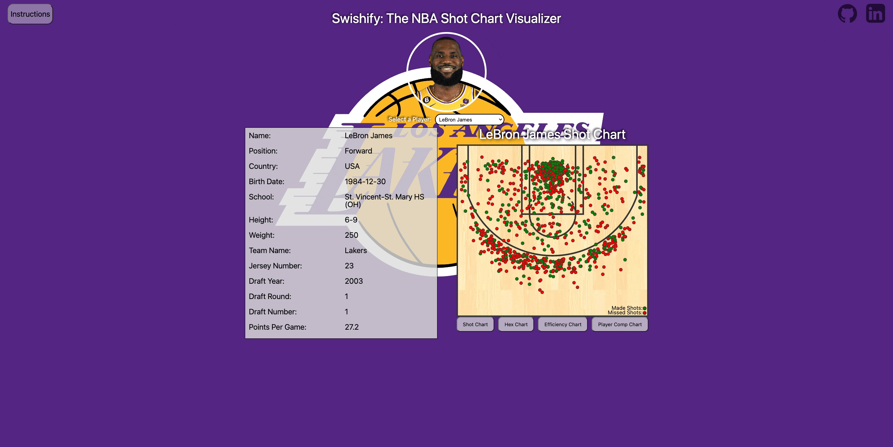
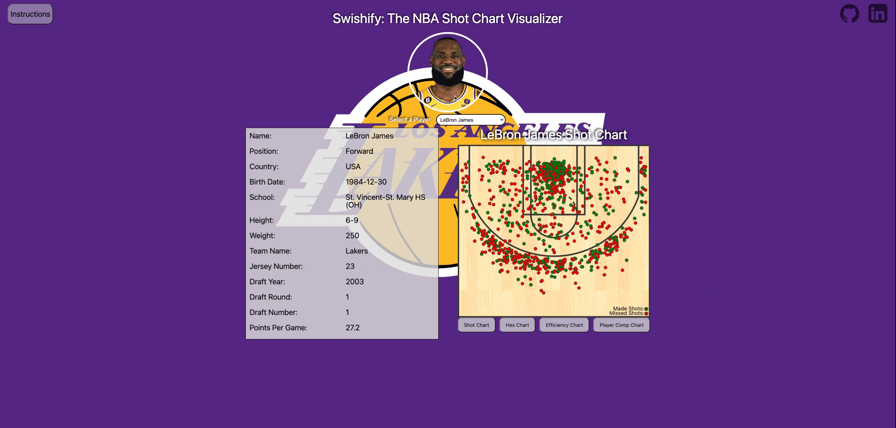
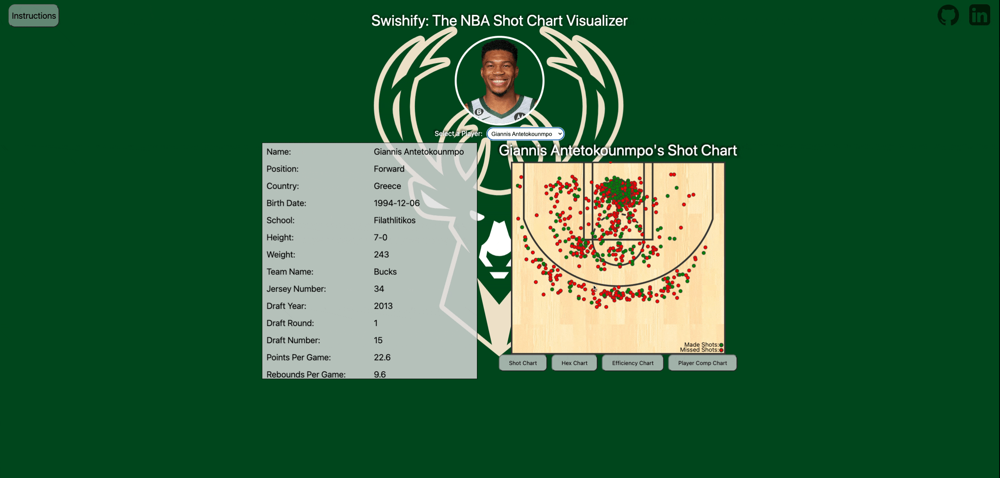
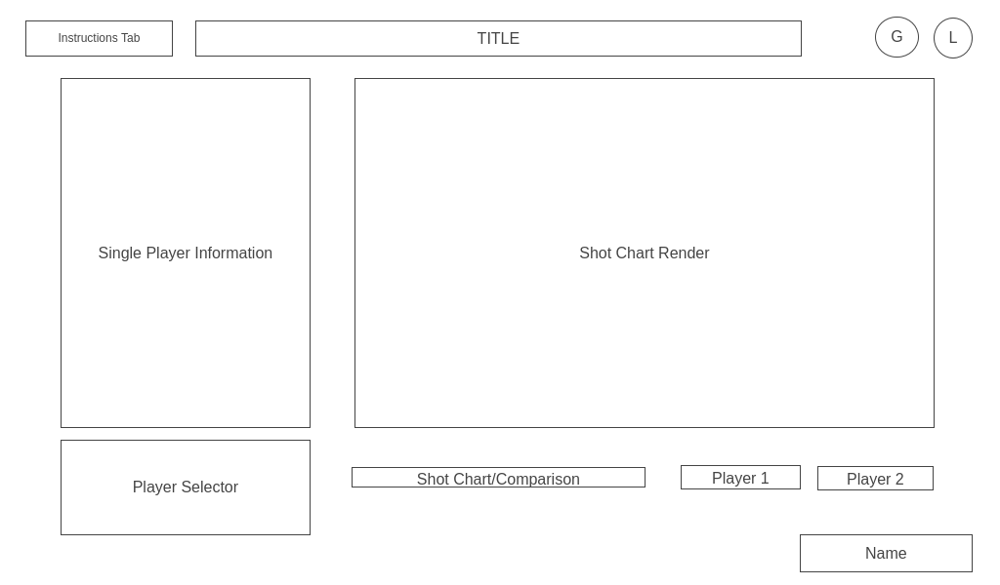

# Swishify

## A Shot Chart Visualizer for Players Selected to the 2023 All-NBA Teams

## Description

Swishify is a data visualizer for the 2023 All-NBA players. The app allows users to select a player and look at their general profile, as well as a variety of shooting data on the court. This ranges from their shot chart to how well they shot in areas on the court compared to another All-NBA player. 

This data is rendered in the form of graphs or plotted onto a top down view of an NBA scaled half court to allow users to visually analyze the data in a more digestable form.

# [LIVE](https://elliotchang126.github.io/Swishify/)

## Utilized Technology

The following libraries and APIs were used to create Swishify:
- [NBA API](https://github.com/swar/nba_api) - NBA API is the source of the data used. Due to the client requiring Python as well as the requests and numpy packages, this data was first pulled and stored as JSON files to be accessed locally.
- [D3.js](https://d3js.org/) - D3.js is the main library used to create the visual components of the data from NBA API. The library was used to draw the half court, as well as create the bar graphs and plots seen on the application.
- [D3 Hexbin](https://github.com/d3/d3-hexbin) - D3's hexbin is utilized to condense the shot chart's data points into hexagonal bins. This allows users to see where the players preferred to shoot from on the half court.
- Webpack & Babel - Used to bundle and transpile the Javascript code.
- NPM - Manage the application's dependencies.

## Functionality

Swishify is fairly easy to use, and users can refer to the instructions tab on the top-left to review how to use the application. The basic functionality boils down to these two elements:

1. Player Select - Using the dropdown in the middle right below the player image allows users to select which player they would like to view. Selecting a player will automatically change the elements in the application to that player's information.

2. Chart Select - These buttons are found below the default shot chart that renders. Users can click the button to select different types of charts to view for that player.

## Features

Swishify's two main features are the shot chart data and the ability to compare the player's average field goal percentage to another player or the league average. 

A typical star NBA player takes over a thousand shots over the course of the regular season. The application takes that data, and renders it into a half-court, allowing users to easily and quickly see these shots from where they were taken on the court. It's also color coordinated so users can see whether they were missed shots or made shots. 

D3 was not very intuitive to use at the beginning, and surprisingly the biggest challenge was actually creating accurate court dimensions so that the shot coordinates would accurately render. The basket was considered the [0, 0] coordinates, and D3 considers those coordinates the top left. This meant that the data needed to be transposed to align with the difference in coordinates. It serves as the basis for both the shot chart and the hexbin chart. The initial plan was iterate through the JSON to pull out the shoot coordinates and the made flag. The function is still currently set up like this, but given time should be revisited to improve the application's time complexity. Additionally, the shot chart is a static element with fixed coordinates. In hindsight, it would be better to make the height and width dynamic and add logic so that the coordinates transpose with the new dimensions so that it can scale with the viewbox. As it is now, the chart is too static.

The second feature is the bar chart makes comparing the selected player easy by just looking at which bar is higher than the other. Utilizing this chart, we can quickly take in how well a player shot compared to a fellow All-NBA player or the league average. In bar chart form, it's a quick scan from the top of the bar to the y-axis to get a rough idea of how much better or worse a player was from a particular zone. The logic and functionality of this was key as it's the foundation for creating both the player comparison and the league average comparison.

The most difficult part of setting the bar chart up was the logic behind how the bar chart is made. There are a variety of built-in D3 methods that required a lot of research to know what these methods even are and how they are used in relation to generating the chart. Even now, there are methods I found online that other people used that I don't quite understand what they do, and some methods I only have a base understanding in.

## Future

Expanding the scope and implement the ability to access all players as well as multiple years in the application. 

<!-- ## Background -->
<!-- Swishify is a data visualizer for All-NBA players for the 2023 season. The purpose is to be able to compare where these top players like to shoot from. It has the following elements:

- Player Profile
- Shot Chart (Field Goals Made and Missed)
- Efficiency to League Average Zone Chart
- Player Comparison Zone Chart

The base functionality of the website is to allow users to view shot data of a player or between players, as well as their profile. -->

<!-- ## Functionality & MVPs

Using Swishify, users will be able to view:

1. A player's profile, with details about the player themselves
2. A player's shot chart from the 2022-23 season
3. A zone chart which color codes where a player shot higher than the league average
4. A comparison zone chart which color codes where one player was more effective than the other
5. Toggle between players and charts with buttons and/or dropdowns

Additionally, this project will include:
- An instructions tab to view details on how to utilize the site
- A production README

## Wireframes

    

- Instruction tab with details on how to use the site
- Github and Linkedin links on the top right
- On the left, the player information renders information about a player, selected in the player selector box below
- On the right, the shot chart renders a half court with depending on the selectors utilized below. The player 2 box should be greyed out if comparison is not selected

## Technologies, Libraries, and APIs

The project will be implemented with the following technologies:

- The NBA API is used to pull data. Due to being in Python, it is pulled first and stored as a JSON file
- The D3.js library is used to create the shot charts and zones
- Webpack and Babel is used to bundle and transpile the source Javascript code
- NPM is utilized to manage project dependencies

** Implementation Timeline

- **Friday & Weekend**: Complete setup for the project. Pull all the data required from the API. Spend time learning the D3.js libary and get a basic half court rendered to show up on screen. Implement the underlying logic to render the data onto the shot chart. Ideally, the logic for all 3 charts will be completed by Sunday.
- **Monday**: Complete any remaining logic that was not done. Begin the CSS styling to make sure that the site looks presentable.
- **Tuesday**: Continue CSS styling. If managed to complete, ensure that everything works correctly with the styling.
- **Wednesday**: Review everything to make sure that the entire project is implemented correctly and nothing breaks.
- **Thursday**: Deploy to GitHub pages. Rewrite this proposal as a production README.

## Potential Bonuses

Some potential anticipated update this could eventually lead to:
- An additional render of shot selection by game
- Increasing the number of years the data is available in
- Light and Dark mode -->